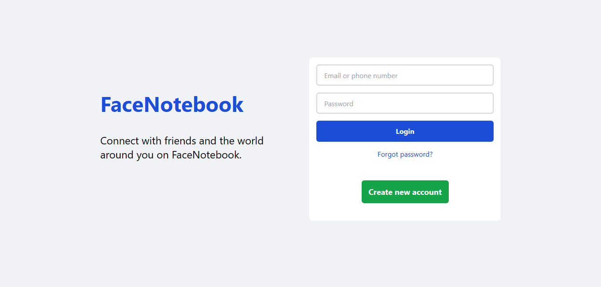
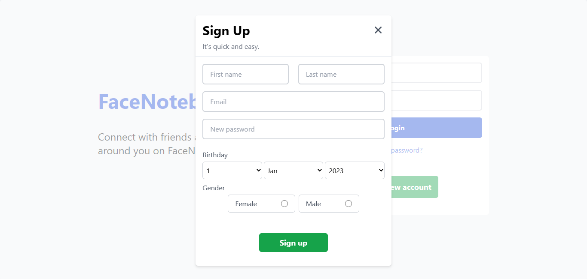
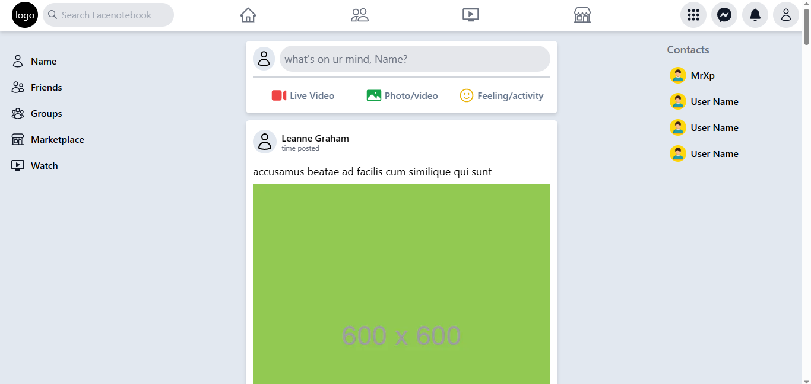

# Facebook clone

This repository contains a Facebook clone project developed using **React**, **Nextjs** and **Tailwindcss**. The project aims to replicate the user interface of the popular social media platform, **Facebook**.

## Screenshots

Here are a few screenshots of the Facebook clone project:

### Login page



### SignUp page



### Feed page



## Installation
To run the Facebook clone project locally, follow these steps:

### 1- Clone the repository:
  ```git clone https://github.com/khalilrume/facenotebook-front-end.git```
  
### 2- Navigate to the project directory:
  ```cd facenotebook-front-end```
  
### 3- Install the dependencies:
  ```npm install```
  
### 4- Start the development server:
  ```npm run dev```
  
### 5- Open your web browser and visit http://localhost:3000 to view the Facebook clone.
